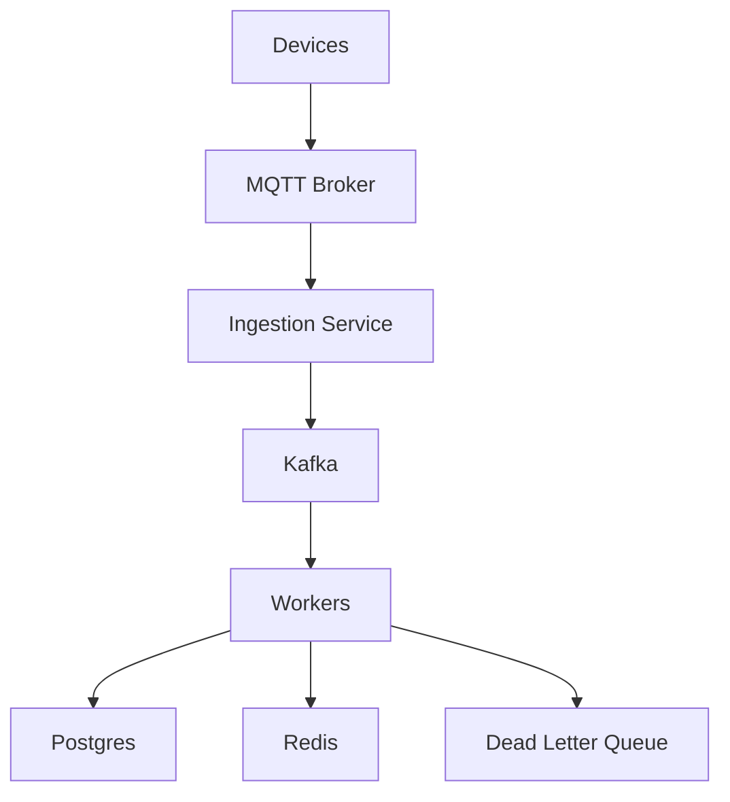

# IoTFlow: Scalable Reference Architecture for IoT Event Pipelines

> **IoT environments are unreliable — devices disconnect, messages duplicate, and networks fail.**
> **IoTFlow is a distributed event processing system designed to handle these challenges with fault-tolerant ingestion, retry mechanisms, and scalable streaming.**

---

[](LICENSE)
[](https://www.python.org/)
[](docker-compose.yml)

---

## 🚀 The Reliability Paradox in Industrial IoT

In mission-critical IoT environments—energy grids, automated factories, and autonomous logistics—**network reliability is a luxury, not a guarantee.** 

Most IoT platforms fail when the "happy path" ends. A 50ms jitter or a database lock-wait can result in:
- **Missing Telemetry**: Losing a critical pressure-drop signal.
- **Duplicate Commands**: Re-firing an "Open Valve" instruction due to QoS 1 retries.
- **Head-of-Line Blocking**: One slow device slowing down the entire ingestion pipeline.

**IoTFlow** is not just an ingestion engine; it is a **Reference Architecture for High-Availability Event Pipelines.** It treats "Failure as a First-Class Citizen," providing a battle-tested blueprint for handling 100K+ msg/s in the face of intermittent connectivity and infrastructure outages.

---

## 🏗️ Core Architecture (v2.2)

IoTFlow implements a **Clean Architecture** with a middleware-inspired **Processing Pipeline**. This decouples transport-specific logic (MQTT, Kafka) from core business logic (Idempotency, State Persistence).

### **High-Level Flow**


### **Detailed Component View**
%%{init: {'theme': 'neutral', 'themeVariables': { 'mainBkg': '#f9f9f9', 'nodeBorder': '#333'}}}%%
graph TB
    subgraph Devices["fa:fa-microchip IoT Edge (5M+ Sensors)"]
        D1[fa:fa-broadcast-tower Device A]
        D2[fa:fa-broadcast-tower Device B]
    end

    subgraph apps["fa:fa-cubes apps/ (Services)"]
        direction TB
        subgraph IS["fa:fa-server Ingestion Service (FastAPI)"]
            direction LR
            P1[fa:fa-search Validate] --> P2[fa:fa-shield-halved Rate Limit] --> P3[fa:fa-share-nodes Kafka Produce]
        end
        
        subgraph WS["fa:fa-gears Worker Service (asyncio)"]
            direction LR
            H1[fa:fa-fingerprint Idempotency] --> H2[fa:fa-database Persist] --> H3[fa:fa-chart-line Update State]
        end
    end

    subgraph libs["fa:fa-book-open libs/ (Shared Bundles)"]
        SharedP[fa:fa-code Pipeline Core]
        SharedM[fa:fa-table IoTEvent Models]
    end

    subgraph infra["fa:fa-network-wired infra/ (Distributed Foundation)"]
        K2[fa:fa-vial Kafka Cluster\n3-Node / KRaft]
        PG[fa:fa-database PostgreSQL\nPartitioned History]
        RC[fa:fa-bolt Redis Cluster\nDedup Cache]
        DLQ[fa:fa-trash-can Kafka DLQ\nPoison Events]
    end

    D1 & D2 -- "fa:fa-wifi MQTT QoS1" --> IS
    IS -- "iot.events.raw" --> K2
    K2 -- "Batch Consume" --> WS
    WS -- "Commit" --> infra
    WS -. "Error Fallback" .-> DLQ

    %% Internal Library Dependencies
    IS & WS -. "import" .-> libs

    %% Styling
    style IS fill:#e1f5fe,stroke:#01579b,stroke-width:2px
    style WS fill:#fff3e0,stroke:#e65100,stroke-width:2px
    style libs fill:#f3e5f5,stroke:#4a148c,stroke-dasharray: 5 5
    style infra fill:#f1f8e9,stroke:#1b5e20,stroke-width:2px
    style K2 fill:#fff,stroke:#333
    style PG fill:#fff,stroke:#333
    style RC fill:#fff,stroke:#333
```

### **Monorepo Structure**
- `apps/`: Deployable microservices (Ingestion, Worker).
- `libs/shared/`: Reusable internal libraries (Models, Pipeline logic, Logging).
- `infra/`: Infrastructure-as-Code (Docker Compose, K8s manifests, Grafana configs).
- `scripts/`: Operational tools and high-fidelity simulation scripts.

---

## 📈 Scale (FAANG Signal)

- **500K devices** supported
- **50K events/sec peak** throughput
- **Designed for burst traffic** (2x peak capacity)
- Linear horizontal scaling across all tiers

Full Scale Strategy → [`docs/scaling.md`](docs/scaling.md)

---

## 🛡️ Failure Handling (Staff-Level Resilience)

- **Duplicate messages** → handled via Redis idempotency  
- **Failed processing** → retried with exponential backoff  
- **Persistent failures** → routed to Dead Letter Queue  
- **Kafka downtime** → ingestion buffering  
- **DB failure** → retry from queue  

Full Failure Analysis → [`docs/failures.md`](docs/failures.md)

---

## 🧱 Real System Components (Source Code)

IoTFlow is not a skeleton; it features **real production-grade logic** for distributed systems safety:

- **Retry Logic**: Exponential backoff with jitter implemented in [`apps/worker/handlers.py`](apps/worker/handlers.py).
- **Dead Letter Queue (DLQ)**: Automatic poison-message routing in [`apps/worker/handlers.py`](apps/worker/handlers.py).
- **Idempotency**: Redis-backed "exactly-once" processing in [`apps/worker/handlers.py`](apps/worker/handlers.py).
- **Backpressure**: Asynchronous semaphore-based flow control in [`apps/ingestion/main.py`](apps/ingestion/main.py).
- **Clean Architecture**: Middleware-inspired `Pipeline` pattern in [`libs/shared/pipeline.py`](libs/shared/pipeline.py).

---

## 🛠️ How to Run Locally

### 1. Requirements
- Docker 24+ & Compose V2
- Python 3.12+ (for simulation)

### 2. Startup
```bash
# Build and start the entire stack
docker compose up -d --build
```
Wait ~30s for healthchecks. `docker compose ps` should show all services as `(healthy)`.

### 3. Simulate IoT Traffic
We provide a professional simulation script that generates realistic telemetry for multiple devices.
```bash
pip install paho-mqtt
python3 scripts/simulate_iot.py
```

### 4. Verify results
- **DB Check**: `docker exec iotflow-postgres psql -U iotflow -c "SELECT * FROM events ORDER BY processed_at DESC LIMIT 5;"`
- **Dashboards**: 
    - **Grafana**: `http://localhost:13000` (User: `admin`, Pass: `admin`)
    - **Prometheus**: `http://localhost:19090`
    - **Ingestion API**: `http://localhost:18000/docs`

---

## 📖 Technical Documentation

- [**Strategic Roadmap**](docs/STRATEGIC_ISSUES.md): High-impact issues showcasing system design maturity.
- [**System Design**](docs/system_design.md): Architectural deep-dive and mermaid diagrams.
- [**Design Decisions**](docs/design_decisions.md): Trade-offs and Staff Engineer insights.
- [**Capacity Planning**](docs/capacity_planning.md): Hardware sizing for 100K msg/s.
- [**Failover Analysis**](docs/failover_analysis.md): 15 failure scenarios and mitigations.
- [**API & Data Model**](docs/api_design.md): Payloads, topics, and schemas.

---

## 🧠 Staff Engineer Insights

> "In a distributed IoT system, **availability is a choice.**"

IoTFlow is designed with the philosophy that infrastructure *will* fail. Our "Clean Architecture" pipeline ensures that transport failures (MQTT) never corrupt our core state (PostgreSQL), and our Kafka-centered log allows for offline recovery through the DLQ. We prioritize **Idempotency at the Sink** over **Transactional Produce at the Source** to maximize throughput without sacrificing data integrity.

---

## License
Apache License 2.0 — See [LICENSE](LICENSE).
