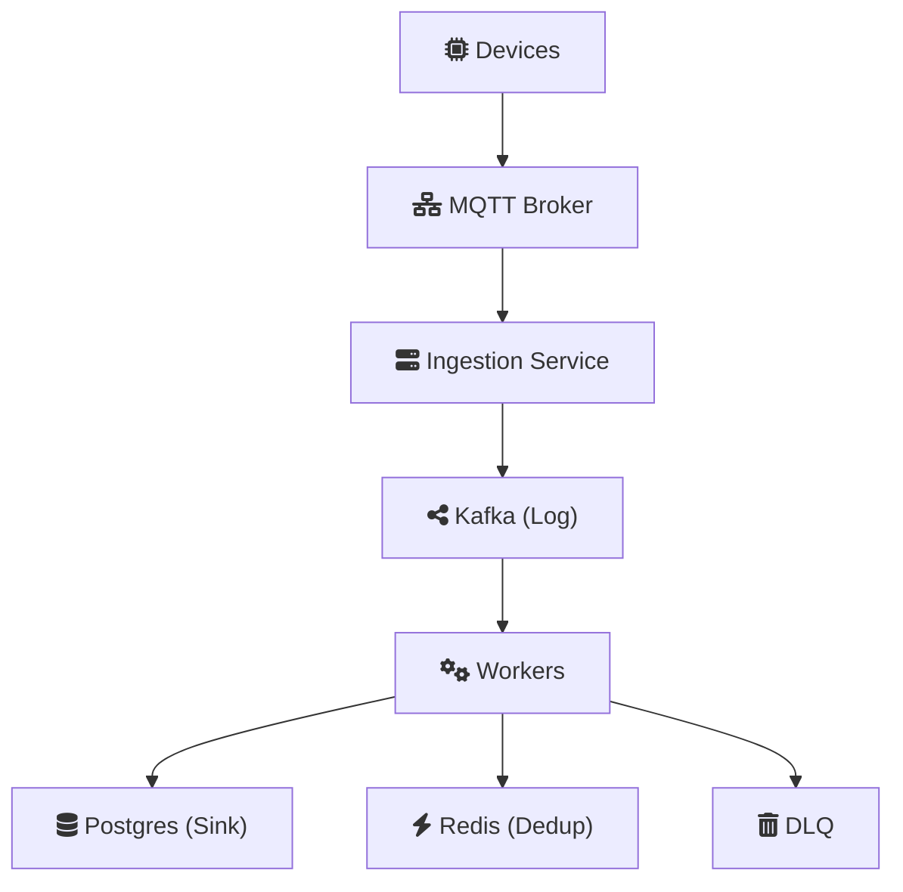
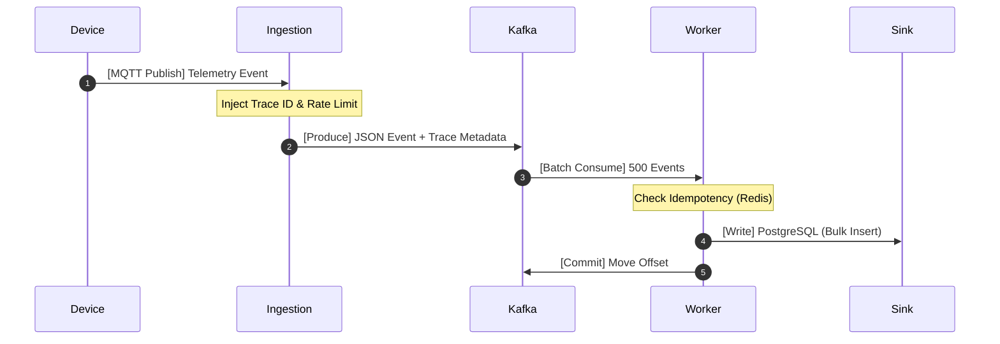

# IoTFlow — Distributed Event Processing for Unreliable Environments

> **IoT environments are inherently unreliable — devices disconnect, messages duplicate, and networks fail.**
> IoTFlow is a **high-throughput, fault-tolerant reference architecture** designed to handle 50,000+ events/sec with linear scalability and effectively-once processing guarantees.

> ⚡ This project serves as a **production-grade system design case study** for building resilient distributed pipelines using Clean Architecture and Event Streaming.

---

[](LICENSE)
[](https://www.python.org/)
[](infra/docker-compose.yml)

---

# 🚀 The Challenge: Reliability at Scale

In industrial IoT (energy, manufacturing, autonomous logistics), "Happy Path" engineering fails. Network jitter, database locks, and QoS 1 retries result in:
- **Telemetry Gaps**: Critical signals lost during transient outages.
- **Double-Counting**: Duplicate command execution due to broker retries.
- **Head-of-Line Blocking**: One slow consumer stalling the entire pipeline.

**IoTFlow minimizes blast radius** by treating failure as a first-class citizen.

---

# 🏗️ Architecture Philosophy

IoTFlow implements a **Clean Architecture** processing pipeline. By decoupling transport-specific logic (MQTT/Kafka) from core business logic (Idempotency/Persistence), we ensure the system is:
1. **Mockable**: Core handlers are tested without any real infrastructure.
2. **Pluggable**: Switch from Kafka to Pulsar or NATS by changing a single handler.
3. **Traceable**: A global **Trace ID** or Correlation ID is injected at the edge and propagated across every service.

## High-Level Flow



---

# 📊 Design for Scale (500K Devices)

### Target Metrics
- **Throughput**: 50,000 events/sec (Peak) / 100,000 events/sec (Burst).
- **Latency**: < 200ms p95 end-to-end processing time.
- **Data Volume**: ~4 TB/day ingestion.

### Capacity Justification
- **Kafka Strategy**: 200 partitions for 100 parallel consumers, ensuring sub-second lag.
- **Redis Dedup**: 2GB memory allows for a **24-hour idempotency window** for 100% of devices.
- **Database Partitioning**: PostgreSQL uses time-series partitioning to maintain fast index-lookups even with 1B+ records.

---

# 🛡️ Operational Reliability (Chaos Proof)

| Potential Failure | Mitigation Strategy | Engineering Logic |
| :--- | :--- | :--- |
| **Broker Duplicates** | Redis ID Map | Ensures "Effectively-Once" across retries. |
| **Consumer Lag** | HPA + Auto-Scaling | Kafka partitions permit horizontal expansion. |
| **Poison Messages** | Dead Letter Queue | Isolates bad payloads without blocking the queue. |
| **Downstream Outage** | Exponential Backoff | Jittered retries prevent thundering herd on recovery. |
| **Infrastructure Split** | Kafka Persistence | Kafka acts as a safety buffer for up to 7 days. |

---

# 🔁 The Event Lifecycle



---

# ⚖️ Engineering Trade-offs

### 1. "At-Least-Once" Delivery vs "Exactly-Once"
We chose **At-Least-Once** with **Sink Idempotency**. True "Exactly-Once" (Kafka transactions) adds significant latency and overhead. Our approach guarantees correctness while maximizing throughput.

### 2. Kafka vs NATS
Kafka was selected for its **Durable Log** capabilities. In IoT, being able to "Replay" data from 2 hours ago if a database fix is deployed is non-negotiable.

### 3. Log-Based Persistence
We prioritize the **Log (Kafka)** as the source of truth. If the Database (Postgres) is slow, the Ingestion service continues at 100% speed, buffering the pressure until the DB scales.

---

# 🧱 Project Structure (Monorepo)

```text
IoTFlow/
├── apps/                        # Microservices (Go/Python/Node friendly)
├── libs/                        # The "Core" Shared Logic (The Clean Pipeline)
├── infra/                       # Production Config (K8s, Docker, Terraform)
├── docs/                        # The "Paperwork" (Sizing, Failover, Runbooks)
├── scripts/                     # SRE Tooling & Simulation
├── Makefile                     # Zero-Friction Developer Entrypoint
└── CONTRIBUTING.md              # Engineering Standards (Linting, Testing)
```

---

# 🛠️ Developer Experience (Zero-Friction)

### One-Command Setup
We believe in a **5-minute onboarding**. Use the [Makefile](Makefile) to manage the entire stack:
```bash
make up        # Start local infrastructure (Docker Compose)
make test      # Run exhaustive unit and integration tests
make lint      # Check type-safety (mypy) and format (black)
make simulate  # Launch high-fidelity IoT device simulator
```

---

# 📊 Observability (The "Staff-Engineer" View)

Every service exports **Prometheus Metrics** on `:9100`:
- **Ingestion Latency**: p50, p90, p99.
- **Kafka Log Lag**: Measures real-time backpressure.
- **DLQ Rate**: Alerts as soon as poison events enter the system.
- **Retry Jitter**: Visualizes background recovery behavior.

---

# 🧠 Performance Insights
> "In high-scale systems, the fastest way to process data is to do it in batches, but the safest way is one-by-one. IoTFlow solves this by implementing **Atomic Batching with Single-Event Isolation** logic."

Explore the detailed case studies:
- [System Design Deep-Dive](docs/architecture.md)
- [Capacity & Sizing Guide](docs/scaling.md)
- [Failure Mode Audit](docs/failures.md)

---

# 📜 License
Apache License 2.0 — See [LICENSE](LICENSE).
