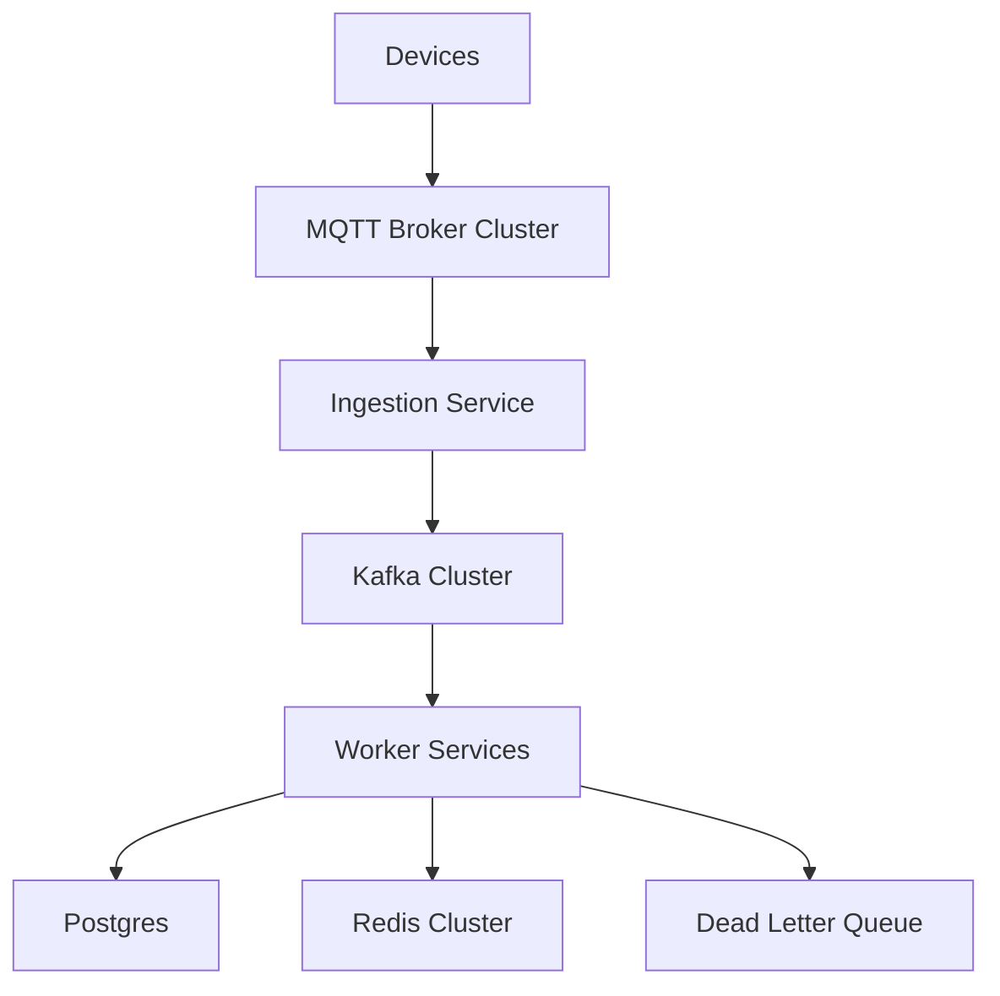
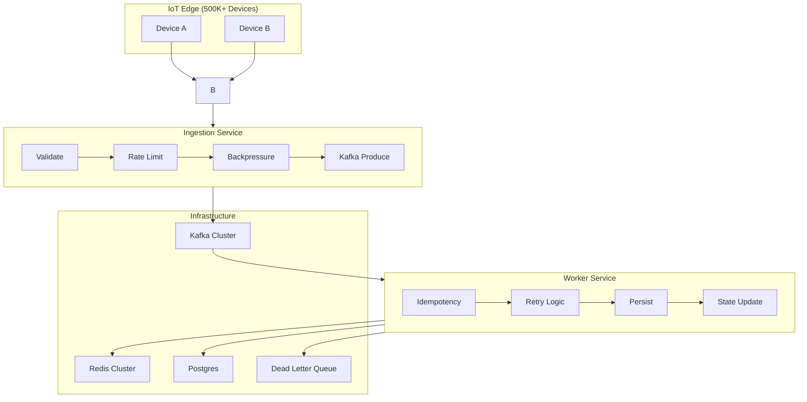
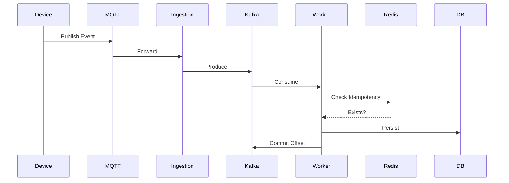

# IoTFlow — Distributed IoT Event Processing System

> **IoT environments are unreliable — devices disconnect, messages duplicate, and networks fail.**
> IoTFlow is a **high-scale distributed event processing system** designed to handle these challenges with fault-tolerant ingestion, retry mechanisms, and scalable streaming.

> ⚡ This project is a **system design case study and production-grade reference architecture**, not just a demo.

---

[](LICENSE)
[](https://www.python.org/)
[](infra/docker-compose.yml)

---

# 🚀 The Reliability Problem in IoT

In industrial IoT systems (energy, manufacturing, logistics), failures are inevitable:

* Devices disconnect unpredictably
* Messages are duplicated (QoS retries)
* Events arrive out-of-order
* Infrastructure components fail independently

👉 IoTFlow is designed to **embrace failure**, not ignore it.

---

# 🏗️ Architecture Overview

## High-Level Flow



---

## Detailed Component View



---

# 📊 Scale & Capacity Planning

## Target Scale

* **500K devices**
* **50K events/sec peak**
* **Supports burst up to 100K events/sec**
* **1KB payload (~50 MB/sec ingestion)**
* **~4 TB/day data volume**

---

## Capacity Justification

* Kafka partitions: **200**
* Consumer workers: **100**
* Batch size: **500 events**
* Redis memory: **~2GB (24h idempotency window)**
* Postgres: **~10K writes/sec (batched)**

👉 Guarantees:

* <200ms processing latency
* Linear scalability
* Burst tolerance

---

# 🛡️ Failure Handling

| Failure             | Strategy                      |
| ------------------- | ----------------------------- |
| Duplicate messages  | Redis idempotency             |
| Out-of-order events | Timestamp + processing window |
| Processing failures | Exponential retry with jitter |
| Poison messages     | DLQ                           |
| Kafka downtime      | Buffer + retry                |
| DB downtime         | Retry from Kafka              |
| Consumer crash      | Rebalance + replay            |

👉 See `docs/failures.md`

---

# 🔁 Event Processing Flow



---

# 🔄 Retry & DLQ Strategy

### Retry

* Immediate retry
* Exponential backoff + jitter
* Max retry threshold

### DLQ

* Failed after retries → DLQ
* Used for debugging & replay

---

# 🧠 Idempotency Strategy

* Key: `device_id + event_id`
* Stored in Redis with TTL

👉 Ensures:
**Effectively-once processing on top of at-least-once delivery**

---

# ⚡ Backpressure Strategy

Multi-layer defense:

1. Kafka lag monitoring
2. Auto-scaling consumers
3. Ingestion throttling (semaphore)
4. Kafka pause/resume
5. Priority queues
6. Event sampling under extreme load

---

# 🌍 Multi-Region Strategy (Future)

* Active-Active regions
* Region-local Kafka clusters
* Global metadata store

Tradeoff:

* Eventual consistency vs availability

---

# ⚖️ Design Tradeoffs

### Kafka vs NATS

* Kafka → durability + replay
* Tradeoff → operational complexity

### At-least-once vs Exactly-once

* At-least-once chosen
* Idempotency ensures correctness

### Redis vs DB

* Redis → low latency
* Tradeoff → TTL expiry

### Partitioning

* Device-based key
* Tradeoff → hotspot risk

### Consistency Model

* Eventual consistency
* Tradeoff → temporary divergence

---

# 🧱 Project Structure

```id="3w8nax"
IoTFlow/
├── apps/                        # Specialized Microservices
│   ├── ingestion/               # MQTT -> Kafka Ingestion
│   └── worker/                  # Kafka -> PG Event Worker
├── libs/                        # Shared Internal Libraries
│   └── shared/                  # The core Clean Architecture Pipeline
├── infra/                       # Infrastructure-as-Code & Config
│   ├── k8s/                     # Kubernetes Manifests & HPA
│   └── docker-compose.yml       # Local dev environment
├── docs/                        # Technical Case Study & Design
│   ├── architecture.md          # System Design Deep-Dive
│   ├── failures.md              # Fault-Tolerance & Resilience Audit
│   ├── scaling.md               # Capacity Planning & Sizing
│   └── design_decisions.md      # Trade-offs & Staff Engineer insights
├── scripts/                     # Operational Tooling
│   └── simulate_iot.py          # High-fidelity IoT Traffic Simulator
├── README.md                    # Executive Summary & Entry point
├── CONTRIBUTING.md              # Software Engineering Standards
└── LICENSE                      # Apache 2.0
```

---

# 🛠️ Running Locally

```bash id="84gk8l"
# Start the infrastructure
docker compose up -d --build
```

### Simulate traffic

```bash id="7v82ul"
# Professional IoT simulator script
pip install paho-mqtt
python scripts/simulate_iot.py
```

---

# 📊 Observability

* Kafka lag
* Retry rate
* DLQ size
* Throughput (TPS)
* Latency (p95/p99)

---

# 🚨 Operational Considerations

* Zero-downtime deployments
* Kafka rebalancing impact
* Redis eviction policies
* Alerting (DLQ spikes, lag)
* SLO monitoring

---

# 📖 Documentation

* [**System Design**](docs/architecture.md): Architectural deep-dive and mermaid diagrams.
* [**Capacity Planning**](docs/scaling.md): Hardware sizing and capacity justification.
* [**Failover Analysis**](docs/failures.md): 15 failure scenarios and mitigations.
* [**Design Decisions**](docs/design_decisions.md): Trade-offs and engineering rationale.
* [**Strategic Roadmap**](docs/STRATEGIC_ISSUES.md): High-impact roadmap and "Smart Hack" issues.

---

# 🧠 Key Insight

> “In distributed systems, reliability is engineered — not assumed.”

IoTFlow prioritizes:

* Idempotency at the sink
* Replay via Kafka
* Failure isolation

---

# 🤝 Contributing

See [**CONTRIBUTING.md**](CONTRIBUTING.md)

---

# 📜 License

Apache License 2.0
