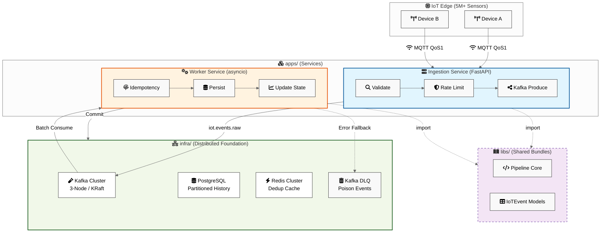

# IoTFlow: Scalable Reference Architecture for IoT Event Pipelines

> **A production-grade distributed system designed for unreliable IoT environments.**
> Built for **100K+ events/sec** with strong idempotency, failure handling, and multi-AZ resilience.

[](LICENSE)
[](https://www.python.org/)
[](docker-compose.yml)

---

## 🚀 The Reliability Paradox in IoT

In industrial IoT (factories, energy grids, logistics), devices operate in "harsh" network environments. Connections are intermittent, but the data is mission-critical. A 10ms temperature spike or a pressure drop in a gas pipeline cannot be missed, duplicated, or processed out of order.

**IoTFlow** is a distributed event backbone that solves the three core challenges of IoT at scale:
1.  **Ingestion Reliability**: Handling millions of concurrent MQTT connections with backpressure.
2.  **Data Integrity**: Guaranteeing "at-least-once" delivery with "exactly-once" processing (idempotency).
3.  **Operational Resilience**: Surviving partial infrastructure failures (Kafka/DB/Redis) without data loss.

---

## 🏗️ Core Architecture (v2.2)

IoTFlow implements a **Clean Architecture** with a middleware-inspired **Processing Pipeline**. This decouples transport-specific logic (MQTT, Kafka) from core business logic (Idempotency, State Persistence).



### **Monorepo Structure**
- `apps/`: Deployable microservices (Ingestion, Worker).
- `libs/shared/`: Reusable internal libraries (Models, Pipeline logic, Logging).
- `infra/`: Infrastructure-as-Code (Docker Compose, K8s manifests, Grafana configs).
- `scripts/`: Operational tools and high-fidelity simulation scripts.

---

## 📈 Capacity & Scaling (v2)
...
Full Capacity Planning → [`docs/capacity_planning.md`](docs/capacity_planning.md)

---

## 🛡️ Failure Handling & Audit
...
Full Failure Analysis → [`docs/failover_analysis.md`](docs/failover_analysis.md)

---

## 🛠️ How to Run Locally

### 1. Requirements
- Docker 24+ & Compose V2
- Python 3.12+ (for simulation)

### 2. Startup
```bash
# Build and start the entire stack
docker compose up -d --build
```
Wait ~30s for healthchecks. `docker compose ps` should show all services as `(healthy)`.

### 3. Simulate IoT Traffic
We provide a professional simulation script that generates realistic telemetry for multiple devices.
```bash
pip install paho-mqtt
python3 scripts/simulate_iot.py
```

### 4. Verify results
- **DB Check**: `docker exec iotflow-postgres psql -U iotflow -c "SELECT * FROM events ORDER BY processed_at DESC LIMIT 5;"`
- **Dashboards**: 
    - **Grafana**: `http://localhost:13000` (User: `admin`, Pass: `admin`)
    - **Prometheus**: `http://localhost:19090`
    - **Ingestion API**: `http://localhost:18000/docs`

---

## 📖 Technical Documentation

- [**System Design**](docs/system_design.md): Architectural deep-dive and mermaid diagrams.
- [**Design Decisions**](docs/design_decisions.md): Trade-offs and Staff Engineer insights.
- [**Capacity Planning**](docs/capacity_planning.md): Hardware sizing for 100K msg/s.
- [**Failover Analysis**](docs/failover_analysis.md): 15 failure scenarios and mitigations.
- [**API & Data Model**](docs/api_design.md): Payloads, topics, and schemas.
- [**Project Roadmap**](docs/ROADMAP.md): Future improvements & starter issues.

---

## License
Apache License 2.0 — See [LICENSE](LICENSE).
