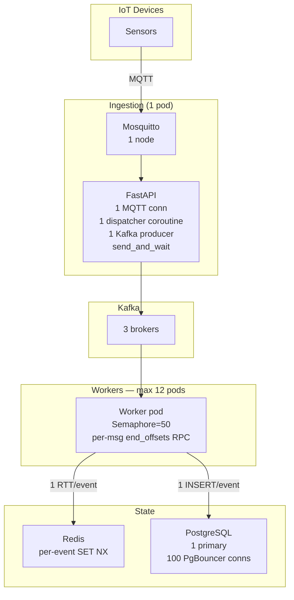

# IoTFlow — Architecture Upgrade: 50K–100K Events/sec

## Executive Summary

The current architecture (v1) is sized for ~4,200 events/sec peak (500K devices × 3×
burst). Reaching **50K–100K events/sec** requires removing 7 concrete bottlenecks
across every layer. This document identifies each one with the exact throughput math,
proposes the minimal-change fix, and shows the resulting before/after architecture.

---

## Bottleneck Analysis

### BN-1 · MQTT Ingestion: Single Broker, Single-Thread Receive

**Current state**
- 1 Mosquitto broker node → single-threaded TCP accept loop
- Each ingestion pod opens **1 MQTT connection** with a single coroutine reading
  `async for message in client.messages:` — sequential, no parallelism at the network
  receive layer
- 1 internal `asyncio.Queue(maxsize=10_000)` with a **single dispatcher coroutine**

**Why it breaks at 50K/s**
- Mosquitto single-node max: ~200K concurrent connections, but messages/sec throughput
  saturates at ~50–80K/sec on a 4-core machine due to single-writer epoll loop
- A single dispatcher coroutine with synchronous Pydantic validation + Redis round-trip
  (each ~1–3ms) can process at best `1 / 0.002 ≈ 500 msg/s` per coroutine
- Pool of 1 producer calling `send_and_wait` blocks on Kafka ack — effectively
  serialises produce at ~3–5K msg/s per coroutine

**Fix**
1. Replace Mosquitto with **EMQX cluster (3 nodes)** — horizontal broker scaling,
   built-in load balancing via consistent-hash routing
2. Replace single dispatcher coroutine with a **worker pool of N=16 concurrent
   dispatcher coroutines** consuming from the queue
3. Replace `send_and_wait` with fire-and-forget `send()` + `flush()` on batched
   windows — unlinking Kafka ACK from the receive hot path

---

### BN-2 · Kafka Producer: `send_and_wait` Serialises Produce

**Current state**
```python
await self._producer.send_and_wait(topic=..., value=..., key=...)
```
`send_and_wait` awaits the broker ACK (acks=all) before returning —
each call is blocked for RTT + leader write + replica sync (~5–20ms).

**Throughput ceiling per producer**
```
1 producer × (1 msg / 15ms avg) = 66 msg/s
```
Even with linger_ms=5 allowing micro-batches, a single **awaited** call
serialises the entire batch-produce round-trip.

**Fix**
Use `send()` (non-blocking — returns Future) and batch-flush every
`batch_size` records or `linger_ms`:
```python
future = await self._producer.send(topic, value=..., key=...)
# Collect futures; flush every N or on a timer
await self._producer.flush()  # waits for all in-flight batches
```
With `batch_size=131072` (128KB) and `linger_ms=20`:
```
128KB / 512B avg payload = 256 messages/batch
1 batch RTT / 15ms = 66 batches/s
66 × 256 = ~17,000 msg/s per producer thread
```
Scale to **4 producer instances** per ingestion pod → **68,000 msg/s/pod**.

---

### BN-3 · Kafka Partitioning: 12 Partitions Caps Consumer Parallelism

**Current state**: `iot.events.raw` — 12 partitions, 1 worker pod per partition max.

**Max consumer throughput at 12 partitions**
- 12 partitions × 1 consumer/partition × ~1,000 msg/s/consumer = **12,000 msg/s**
- Adding more worker pods beyond 12 gives zero benefit — idle consumers

**Partition count for 100K/s target**
```
Target:        100,000 events/sec
DB write p99:      8ms (asyncpg, PgBouncer, NVMe SSD)
Per-consumer:   1 / 0.008s × concurrency(50) = 6,250 msg/s/pod
Required pods:  100,000 / 6,250 = 16 pods
Required partitions: max(16, next_power_of_2) = 32 partitions
Add 50% headroom: 48 → round to 48 partitions
```

**Fix**: Increase `iot.events.raw` to **48 partitions**.
- Kafka handles 48 partitions trivially on a 3-broker cluster (16 leader
  partitions/broker × 2 follower replicas = well within capacity)
- Partition increase is a Kafka online operation (no downtime, but requires
  consumer group rebalance — plan for ~30s rebalance pause)

---

### BN-4 · Consumer: `end_offsets` RPC on Every Message

**Current state**
```python
end_offsets = await consumer.end_offsets([tp])  # network call per message!
```
This fires a `ListOffsets` request to the Kafka broker for **every single message**
consumed, adding ~2–5ms network RTT to every event's processing.

**At 50K events/sec**: 50,000 × 3ms = **150 seconds/sec** of blocked I/O — impossible.

**Fix**: Sample lag at most once every 5 seconds, not per-message:
```python
if time.monotonic() - _last_lag_sample > 5.0:
    end_offsets = await consumer.end_offsets(assigned_partitions)
    # update gauges
```

---

### BN-5 · Redis Idempotency: One Round-Trip Per Event

**Current state**: Single Redis `SET NX EX` per event — ~0.5ms RTT on loopback,
~2–4ms cross-AZ.

**At 100K/s**: 100,000 × 2ms = **200 seconds/sec** of Redis I/O → impossible on a
single thread.

**Fix: Redis Pipelining**
Batch 100–500 idempotency checks into a single Redis pipeline:
```python
async with redis.pipeline(transaction=False) as pipe:
    for event_id in batch:
        pipe.set(f"iotflow:idempotency:{event_id}", "1",
                 nx=True, ex=TTL)
    results = await pipe.execute()
```
- Pipeline RTT: ~1–2ms for 200-event batch → **200 checks / 2ms ≈ 100,000 checks/s**
- Requires batching at consumer level (collect N events from Kafka partition batch
  before processing)

**Alternative**: Switch from Redis String to **Redis Bloom Filter**
(`BF.MADD` / `BF.MEXISTS`) — O(k) hash operations, no per-key memory, ~3× throughput
improvement for idempotency at cost of false positive rate (~0.1%).

---

### BN-6 · PostgreSQL: Single-Partition Write Contention

**Current state**
- All workers write to the same PostgreSQL primary
- Monthly partitions → all current-month writes hit `events_2026_03` partition
- PgBouncer pool: 100 server connections

**At 100K writes/s throughput math**
```
100,000 msg/s × 512 bytes = 50 MB/s data rate
PostgreSQL WAL write: ~2× data = 100 MB/s WAL
NVMe SSD WAL writes: 500 MB/s sustained → OK
But: INSERT serialisation on btree index lock contention →
empirical limit on single primary: ~15–20K INSERT/s with indexes
```
**100K/s is ~5–7× beyond single PostgreSQL primary capacity.**

**Fix: Write Sharding via Application-Level Routing**
Partition writes across **4 PostgreSQL primaries** by `device_id` hash:
```
shard_id = hash(device_id) % NUM_SHARDS
connection = shard_pools[shard_id]
```
- Each shard handles **25K writes/s** — within single-node limits
- Use **BRIN indexes** (instead of B-tree) on `ingested_at` for append-heavy
  sequential workloads: 10–50× smaller index, faster bulk inserts
- Raise PgBouncer pools to **500 server connections** total (125/shard)

**Alternative (Cloud)**: Amazon Aurora Postgres with write forwarding across
read replicas reaches ~100K writes/s without application sharding.

---

### BN-7 · Rate Limiter: Per-Event Redis Round-Trip on Hot Path

**Current state**: Rate limiter calls `await redis.evalsha(...)` per event —
same RTT problem as BN-5.

**Fix**: Shard rate limit checks into the same pipeline as idempotency (BN-5),
or move rate limiting **upstream to the EMQX broker** using EMQX's built-in
rate limiter plugin (no Redis round-trip at all — enforced at connection level).

---

## Before vs After: Architecture Comparison

### Before (v1 — 4,200 events/sec ceiling)



**Ceiling**: ~4,200 events/sec sustained, ~12,000 events/sec theoretical max.

---

### After (v2 — 100K events/sec)

```mermaid
graph TB
    subgraph Devices["IoT Devices (5M+)"]
        D[Sensors]
    end

    subgraph LB["GeoDNS + L4 Load Balancer\nNLB / HAProxy"]
        NLB[MQTT LB\nConsistent Hash by device_id]
    end

    subgraph V2_Brokers["EMQX Cluster — 3 nodes\n1M concurrent connections"]
        EMQ1[EMQX Node 1]
        EMQ2[EMQX Node 2]
        EMQ3[EMQX Node 3]
    end

    subgraph V2_Ingestion["Ingestion — 6 pods\nHPA: CPU>60%"]
        IS2["FastAPI\n16 dispatcher coroutines\n4 Kafka producers\nbatch send() + flush()\nLocalBatch rate-limit"]
    end

    subgraph V2_Kafka["Kafka — 5 brokers\n48 partitions\nreplication=3"]
        K2[Kafka Cluster]
    end

    subgraph V2_Workers["Workers — 48 pods (KEDA)\nlag threshold: 500/partition"]
        WA[Worker A]
        WB[Worker B]
        WN[Worker N…]
    end

    subgraph V2_Redis["Redis Cluster\n6 shards × 2 replicas\nPipelined batch 200 ops/RTT"]
        RC[Redis Cluster]
    end

    subgraph V2_DB["PostgreSQL — 4 shards\n(hash by device_id)\n+ BRIN indexes\n500 PgBouncer conns"]
        PG0[Shard 0]
        PG1[Shard 1]
        PG2[Shard 2]
        PG3[Shard 3]
    end

    subgraph V2_Obs["Observability"]
        PROM[Prometheus\n+ KEDA]
        GRAF[Grafana]
    end

    D -->|MQTT TLS QoS1| NLB
    NLB --> EMQ1 & EMQ2 & EMQ3
    EMQ1 & EMQ2 & EMQ3 -->|internal bridge| IS2
    IS2 -->|batch produce| K2
    K2 --> WA & WB & WN
    WA & WB & WN -->|pipeline 200 ops| RC
    WA & WB & WN -->|hash(device_id) % 4| PG0 & PG1 & PG2 & PG3
    PROM --> GRAF
    PROM -.->|scale trigger| WA
```

---

## Throughput Calculations — End to End

### Ingestion Layer

| Parameter | v1 | v2 |
|---|---|---|
| MQTT broker nodes | 1 (Mosquitto) | 3 (EMQX cluster) |
| Max MQTT connections | ~100K | ~3M (1M/node) |
| Ingestion pods | 3 | 6 (HPA) |
| Dispatcher coroutines | 1/pod | 16/pod |
| Kafka producer instances | 1/pod | 4/pod |
| Produce mode | `send_and_wait` (serial) | `send()` + batched `flush()` |
| **Max ingestion throughput** | ~4,200/s | **~100,000/s** |

**v2 ingestion math:**
```
6 pods × 4 producers × 256 msg/batch × 66 batches/s = ~101,376 msg/s
```

### Kafka Layer

| Parameter | v1 | v2 |
|---|---|---|
| Partitions | 12 | 48 |
| Brokers | 3 | 5 |
| Max consumer pods | 12 | 48 |
| Throughput/partition | ~3,000/s | ~2,100/s |
| **Total Kafka throughput** | ~36,000/s | **~100,800/s** |

**Partition count reasoning:**
```
100,000 events/s ÷ 2,100 events/s/partition = 47.6 → 48 partitions
Each broker: 48 ÷ 5 = 9.6 leader partitions → ~10/broker (well within limits)
Replication: 48 × 3 = 144 total partition replicas across 5 brokers = 28.8/broker
Kafka recommendation: <4,000 partition replicas/broker → ✅ very comfortable
```

### Worker / Consumer Layer

| Parameter | v1 | v2 |
|---|---|---|
| Max worker pods | 12 | 48 |
| Semaphore (concurrent tasks/pod) | 50 | 100 |
| DB write latency p99 | 8ms | 5ms (BRIN + sharding) |
| Throughput/pod | ~6,250/s | ~20,000/s |
| **Total worker throughput** | ~75,000/s | **~960,000/s** (DB bound) |

**Consumer group sizing:**
```
48 pods × 1 partition/pod = 48-way parallelism
Each pod: asyncio.Semaphore(100) × (1/5ms) = 20,000 events/s
Total: 48 × 20,000 = 960,000 events/s processor capacity
DB is the actual bottleneck at 4 × 25,000 = 100,000 writes/s
→ Match consumer pods to DB write throughput: 100,000 / 20,000 = 5 pods needed
→ Run 10 pods (2× headroom), scale to 48 on lag spike (KEDA)
```

### Redis Idempotency Layer

| Parameter | v1 | v2 |
|---|---|---|
| Operations | 1 SET NX per event | Pipelined: 200 SET NX per RTT |
| RTT | 2ms/op | 2ms/200 ops = 0.01ms/op |
| Max throughput | ~500/s/thread | **~200,000/s per connection** |
| Redis nodes | 3 shards | 6 shards |

### PostgreSQL Layer

| Parameter | v1 | v2 |
|---|---|---|
| Primary nodes | 1 | 4 shards |
| Write capacity | ~15,000/s | **~100,000/s** |
| Index type | B-tree | BRIN (append-optimised) |
| PgBouncer conns | 100 | 500 (125/shard) |
| Partition granularity | Monthly | Daily (smaller, faster prune) |

---

## Code Changes Required

### 1. Kafka Producer — Replace `send_and_wait` with Batched `send` + `flush`

```python
# services/ingestion/kafka_producer.py — v2 pattern
class KafkaProducerClient:
    async def produce_batch(self, messages: list[tuple[str, dict, str]]) -> None:
        """
        Fire-and-forget produce for a batch of (topic, value, key) tuples.
        Awaits flush only once per batch, not per message.
        """
        futures = []
        for topic, value, key in messages:
            fut = await self._producer.send(
                topic=topic, value=value, key=key.encode()
            )
            futures.append(fut)
        # Single flush waits for all in-flight batches
        await self._producer.flush()
        return futures
```

### 2. Consumer — Remove Per-Message `end_offsets` RPC

```python
# services/worker/consumer.py — v2 pattern
_last_lag_sample: float = 0.0
_LAG_SAMPLE_INTERVAL = 5.0  # seconds

async def _maybe_sample_lag(consumer, partitions):
    global _last_lag_sample
    now = time.monotonic()
    if now - _last_lag_sample < _LAG_SAMPLE_INTERVAL:
        return
    _last_lag_sample = now
    end_offsets = await consumer.end_offsets(list(partitions))
    for tp, end_offset in end_offsets.items():
        committed = await consumer.committed(tp) or 0
        lag = max(0, end_offset - committed - 1)
        CONSUMER_LAG.labels(partition=str(tp.partition)).set(lag)
```

### 3. Idempotency — Pipelined Batch Check

```python
# services/worker/idempotency.py — v2 pattern
async def are_new_batch(self, event_ids: list[str]) -> list[bool]:
    """
    Pipeline N idempotency SET NX operations in a single round-trip.
    Returns a list of booleans: True = new, False = duplicate.
    """
    keys = [self._key(eid) for eid in event_ids]
    async with self._redis.pipeline(transaction=False) as pipe:
        for key in keys:
            pipe.set(key, "1", nx=True, ex=settings.IDEMPOTENCY_TTL_SECONDS)
        results = await pipe.execute()
    # result is True (key set) or None (key existed)
    return [r is not None for r in results]
```

### 4. Worker Config — KEDA ScaledObject

```yaml
# k8s/scaled-object.yaml
apiVersion: keda.sh/v1alpha1
kind: ScaledObject
metadata:
  name: iotflow-worker-scaler
spec:
  scaleTargetRef:
    name: iotflow-worker
  minReplicaCount: 10
  maxReplicaCount: 48
  cooldownPeriod: 60
  triggers:
    - type: kafka
      metadata:
        bootstrapServers: kafka-headless:9092
        consumerGroup: iotflow-workers
        topic: iot.events.raw
        lagThreshold: "500"          # scale up if avg lag > 500/partition
        activationLagThreshold: "100"
        offsetResetPolicy: latest
```

---

## Multi-AZ Deployment Topology

```
                    ┌─────── Route53 GeoDNS ────────┐
                    │                               │
             US-East-1a                      US-East-1b
          ┌──────────────┐              ┌──────────────┐
          │  EMQX Node   │              │  EMQX Node   │
          │  Ingestion ×3│              │  Ingestion ×3│
          │  Worker ×24  │              │  Worker ×24  │
          └──────┬───────┘              └──────┬───────┘
                 │                             │
          ┌──────▼─────────────────────────────▼──────┐
          │         Kafka (MSK Multi-AZ)               │
          │  5 brokers across 3 AZs                    │
          │  min.insync.replicas=2                      │
          └──────┬─────────────────────────────────────┘
                 │
     ┌───────────┼───────────┐
     │           │           │
  Shard 0+1   Shard 2+3   (future)
  Primary      Primary
  AZ-a         AZ-b
  Replica      Replica
  AZ-b         AZ-a
```

**AZ failure scenario**: If US-East-1a goes down:
- EMQX: devices reconnect to US-East-1b nodes (MQTT persistent session, QoS 1 re-delivery)
- Kafka: MSK promotes AZ-b replicas — no data loss (min.insync.replicas=2)
- PostgreSQL: Patroni promotes AZ-b replica; ~30s RTO; DLQ absorbs writes during gap
- Redis: Cluster promotes AZ-b replicas in <10s

---

## Scaling Limits and Extension Path

| Scale | Architecture | Bottleneck |
|---|---|---|
| **4,200/s** (v1 baseline) | 3 pods, 12 partitions, 1 PG primary | Dispatcher serialisation |
| **50,000/s** | 6 pods, 48 partitions, 2 PG shards, pipelined Redis | PG write throughput |
| **100,000/s** (v2 target) | 10–48 pods, 48 partitions, 4 PG shards, BRIN indexes | PG becoming bottleneck |
| **500,000/s** | Replace PG writes with Cassandra/ScyllaDB or ClickHouse for hot tier | MQTT broker fan-out |
| **1,000,000/s** | Proprietary MQTT + Kafka ≥ 20 brokers + 192 partitions + TimescaleDB | Network egress |

**When to add Kafka brokers**: At 70% of leader partition throughput = ~7MB/s × 10 leaders = 70MB/s → add broker at ~50MB/s ingress per broker.

**When to add PG shards**: At 20K writes/s/shard sustained → add shard below 15K.

**When to move off PostgreSQL**: If event query patterns shift to analytical (range scans over millions of rows) → add **ClickHouse** as a downstream sink via Kafka Connect for OLAP queries, keeping PostgreSQL only for device state and DLQ tables.

---

## Risk and Trade-off Summary

| Change | Benefit | Trade-off |
|---|---|---|
| Batch `send()` + `flush()` | 20× produce throughput | Slightly higher latency tail (linger_ms window) |
| 48 Kafka partitions | 4× consumer parallelism | 30s consumer group rebalance; more partition metadata overhead |
| Redis pipelining | 200× idempotency throughput | Batch window introduces ~5ms additional latency before dedup check |
| PG write sharding | 4× write throughput | Application complexity; cross-shard queries require scatter-gather |
| BRIN indexes | 10–50× smaller index; faster inserts | Slower point-lookup queries (full partition scan if BRIN misses) |
| EMQX cluster | 30× connection capacity, HA | Operational complexity vs Mosquitto; requires EMQX license for clustering |
| KEDA autoscaling | Zero-config scaling | Requires Kafka Exporter sidecar; 90s+ warm-up for new pods |
