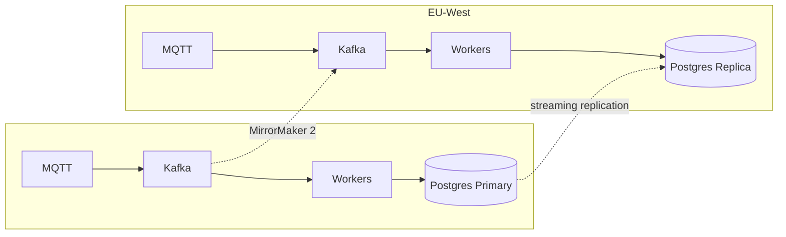

# IoTFlow — Scaling Strategy & Trade-offs

## 1. Scale Numbers (Real-World Sizing)

### Baseline Assumptions
| Metric | Value |
|---|---|
| IoT Devices | 500,000 active |
| Events per device per hour | 10 |
| Peak multiplier | 3× |
| Event payload size | ~512 bytes avg |

### Derived Load
| Metric | Normal | Peak |
|---|---|---|
| Events/second | ~1,400 | ~4,200 |
| Events/day | ~120M | ~360M |
| Ingress throughput | ~700 KB/s | ~2.1 MB/s |
| Kafka topic throughput | ~700 KB/s | ~2.1 MB/s |
| DB writes/sec | ~1,400 | ~4,200 |

---

## 2. Scaling Each Component

### MQTT Broker (EMQX)
- Single EMQX node handles ~1M concurrent connections.
- For 500K devices: **2-node EMQX cluster** (1 active + 1 standby or both active with load balancer).
- Scale trigger: CPU > 60% sustained or connection count > 800K.
- Partition topics by device prefix hash across nodes if needed.

### Ingestion Service (FastAPI)
- Each pod: **2 CPU / 4GB RAM**, handles ~500 events/sec with async I/O.
- **3 pods normal, 9 pods peak** (HPA on CPU + request rate).
- Stateless — any pod can handle any device.
- MQTT subscriptions partitioned by topic prefix across pods.

### Kafka
- **3-broker cluster** (each: 8 CPU / 32GB RAM / 2TB SSD NVMe).
- `iot.events.raw`: 12 partitions → 12 parallel consumers max.
- Throughput per partition: ~10 MB/s (Kafka benchmarks).
- Scale: add brokers + increase partitions (no downtime with Cruise Control reassignment).
- **Real numbers**: 3 brokers × 10 MB/s = 30 MB/s safely saturates our 2.1 MB/s need.

### Worker Service
- Each pod: **2 CPU / 2GB RAM**, handles ~200 events/sec (asyncio + DB pool).
- **7 pods normal, 21 pods peak** (KEDA on consumer lag).
- Consumer group `iotflow-workers`: max parallelism = partition count (12).
- Scale K8s to 12+ pods to saturate all partitions at peak.

### Redis
- **Redis Cluster: 3 shards × 2 replicas = 6 nodes**.
- Each shard: 4 CPU / 16GB RAM.
- `SET NX` @ 4,200/sec: well within Redis's 100K+ ops/sec capacity.
- Memory: 4,200 events/sec × 72h × 50 bytes/key = ~54GB total → 18GB per shard (comfortable).

### PostgreSQL
- **Primary + 2 streaming replicas** (Patroni).
- Primary: 16 CPU / 64GB RAM / 4TB NVMe RAID.
- PgBouncer: 100 server connections, 1000 client connections.
- Write throughput: 4,200 INSERTs/sec → ~100 MB/s disk write (SSD handles 500MB/s+).
- Monthly partition pruning keeps query performance constant.
- **Sharding** (future): shard by `device_id` mod N if write throughput exceeds single-primary limits (~10K inserts/sec).

---

## 3. Kafka vs NATS — Decision Analysis

| Dimension | Kafka | NATS JetStream |
|---|---|---|
| **Durability** | ✅ Durable — disk-backed, replicated WAL | ✅ Durable (JetStream) — file-backed |
| **Ordering** | ✅ Per-partition ordering | ⚠️ Per-subject, no global ordering guarantee |
| **Replay** | ✅ Rewindable log, configurable retention | ✅ JetStream supports replay |
| **Throughput** | ✅ Very high — designed for streaming | ✅ High, but optimized for messaging |
| **Latency** | ~5-10ms p99 | ~1-2ms p99 (lower latency) |
| **Consumer groups** | ✅ Native (consumer group protocol) | ✅ JetStream consumer groups |
| **Ops complexity** | ⚠️ High — ZooKeeper/KRaft, tuning | ✅ Low — single binary, simple config |
| **Ecosystem** | ✅ Massive — Flink, Spark, Kafka Connect | ⚠️ Smaller ecosystem |
| **Schema Registry** | ✅ Confluent Schema Registry | ⚠️ No built-in |
| **Multi-datacenter** | ✅ MirrorMaker 2, Confluent Replicator | ✅ Leaf nodes, Hub-spoke |

### **Decision: Kafka**
**Rationale**: IoTFlow's primary concerns are **durability, replayability, and ecosystem integration** (Kafka Connect for DB sinks, Flink for stream processing in v2). NATS is excellent for low-latency use cases (command & control), so a hybrid is plausible: NATS for downlink (server→device commands), Kafka for uplink (device→server telemetry).

---

## 4. Consistency vs. Availability (CAP Analysis)

IoTFlow's components each make different CAP trade-offs:

| Component | CAP Choice | Reasoning |
|---|---|---|
| **MQTT Broker** | AP | Devices must connect even during partition; broker prioritizes availability |
| **Kafka** | CP | Partition-leader election; prefers consistency over split-brain writes |
| **Redis (idempotency)** | AP | Degrade gracefully on failure; short duplicate window acceptable |
| **PostgreSQL** | CP | Source of truth; rejects writes rather than risk split-brain |

### Overall System: **AP with eventual consistency**
- **Tolerate temporary duplicates**: Redis miss → DB `ON CONFLICT` catches it.
- **Never lose events**: Kafka retention ensures events survive processing layer failures.
- **Accept write delay, not data loss**: DB downtime → DLQ → replay after recovery.

### Tuning Knob: `CONSISTENCY_MODE`
| Mode | Behavior | Use Case |
|---|---|---|
| `strict` | Synchronous Redis check + DB write with `SELECT FOR UPDATE` | Financial / compliance data |
| `relaxed` (default) | Redis check + `ON CONFLICT DO NOTHING` | Telemetry, sensor readings |
| `fire-and-forget` | Skip Redis; async DB write | High-frequency metrics where a few dups are OK |

---

## 5. Multi-Region Strategy

- Devices connect to nearest MQTT cluster (GeoDNS).
- Kafka MirrorMaker 2 cross-replicates topics for global event log.
- PostgreSQL: one global primary, regional read replicas.
- Failover: promote EU replica to primary if US-East goes down (RTO < 30s with Patroni).

---

## 6. Summary: Real Numbers at a Glance

| Resource | Normal Load | Peak Load |
|---|---|---|
| Ingestion pods | 3 | 9 |
| Worker pods | 7 | 21 |
| Kafka partitions | 12 | 12 (add more for >10K events/sec) |
| Kafka brokers | 3 | 5 (add at 70% capacity) |
| Redis shards | 3 | 6 (add at 70% memory) |
| PG connections (via PgBouncer) | ~300 | ~700 |
| Estimated AWS cost (monthly) | ~$3,500 | ~$9,000 |
