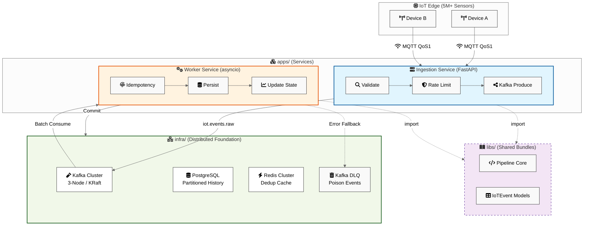
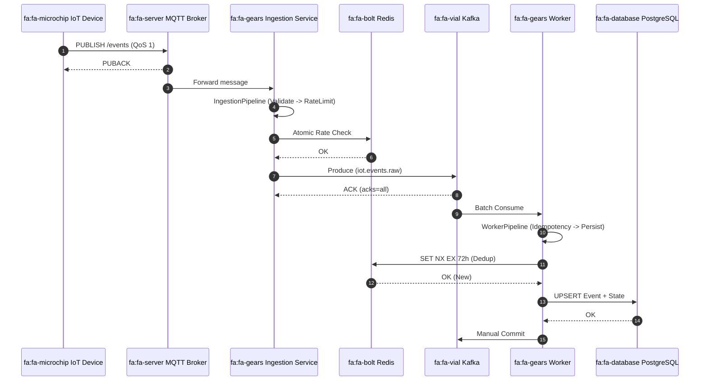
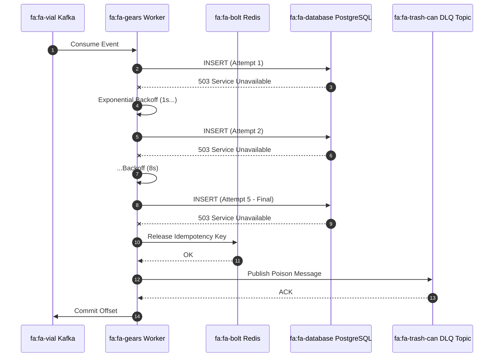
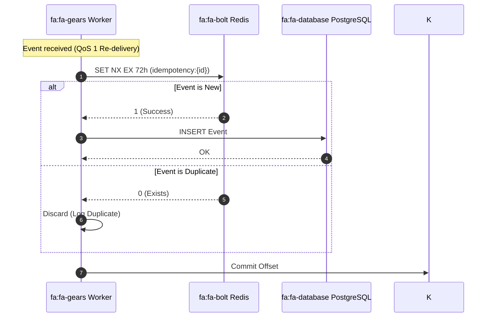

# IoTFlow — System Architecture

## 1. High-Level Architecture

IoTFlow ingests events from millions of IoT devices over MQTT, streams them via Kafka, processes them asynchronously with stateless workers, enforces idempotency via Redis, and persists canonical device state and event history to PostgreSQL. A Dead Letter Queue (DLQ) captures all unprocessable events for offline analysis and replay.

---

## 2. Component Breakdown

### 2.1 MQTT Broker (EMQ X / Mosquitto)
| Attribute | Detail |
|---|---|
| Role | Protocol gateway for device connectivity |
| Protocol | MQTT 3.1.1 / 5.0 over TLS |
| Auth | mTLS + JWT-based username/password |
| QoS | QoS 1 (at-least-once) from device→broker |
| Clustering | EMQX horizontal cluster via Raft |
| Backpressure | `max_inflight_messages`, per-client rate limiting |

### 2.2 Ingestion Service
| Attribute | Detail |
|---|---|
| Runtime | Python 3.12, FastAPI (async), `aiomqtt` |
| Responsibility | Subscribe all MQTT topics → validate schema → produce to Kafka |
| Rate Limiting | Token bucket per `device_id` in Redis (Lua script) |
| Schema Validation | JSON Schema (Draft 7) via `jsonschema` + Pydantic |
| Scaling | Stateless — scale horizontally behind a load balancer |
| Health | `/healthz` (liveness), `/readyz` (readiness) |

### 2.3 Kafka Cluster
| Attribute | Detail |
|---|---|
| Role | Durable, ordered, replayable event log |
| Topics | `iot.events.raw`, `iot.events.validated`, `iot.events.dlq` |
| Partitioning | Partitioned by `device_id` (ensures per-device ordering) |
| Replication | `replication.factor=3`, `min.insync.replicas=2` |
| Retention | `iot.events.raw` = 7 days, DLQ = 30 days |
| Producer Acks | `acks=all` — strongest durability guarantee |

### 2.4 Worker Service
| Attribute | Detail |
|---|---|
| Role | Consume validated events, apply business logic, persist |
| Consumer Group | `iotflow-workers` — enables parallel consumption |
| Offset Management | Manual commit after successful DB write |
| Idempotency | Redis `SET NX EX` with `event_id` key before DB write |
| Retry | Exponential backoff up to 5 attempts, then DLQ |
| Processing | Async I/O — `asyncpg` for PG, `redis.asyncio` |

### 2.5 Redis Cluster
| Attribute | Detail |
|---|---|
| Role | Idempotency store + rate limiter |
| Idempotency TTL | 72 hours (covers retry windows) |
| Rate Limit | Sliding window counter per device (Lua atomic) |
| Cluster Mode | Redis Cluster (3 shards × 2 replicas) |
| Failure Mode | Degrade gracefully — skip Redis check under failure, accept duplicates |

### 2.6 PostgreSQL
| Attribute | Detail |
|---|---|
| Role | Source of truth — device registry, processed events, device state |
| HA Setup | Primary + 2 streaming replicas (Patroni / RDS Multi-AZ) |
| Connection Pool | PgBouncer (transaction mode, pool size 100) |
| Partitioning | `events` table partitioned by `created_at` (monthly) |
| Writes | Workers write directly to primary |
| Reads | API / dashboards read from replicas |

### 2.7 Dead Letter Queue (DLQ)
| Attribute | Detail |
|---|---|
| Implementation | Kafka topic `iot.events.dlq` |
| Trigger | Event fails all retry attempts OR fails schema validation with no fix path |
| Message Envelope | Original payload + error reason + retry count + timestamp |
| Replay | Manual or automated via DLQ-replay service (re-publishes to `iot.events.raw`) |
| Alerting | Prometheus alert if DLQ message rate > threshold |

### 2.8 Observability Stack
| Component | Tool | Purpose |
|---|---|---|
| Metrics | Prometheus + Grafana | Latency, throughput, error rates, lag |
| Logging | Structured JSON → Loki / ELK | Correlation by `event_id`, `device_id`, `trace_id` |
| Tracing | OpenTelemetry (optional phase 2) | End-to-end request traces |
| Alerting | Grafana Alerting / PagerDuty | SLA breaches, DLQ spikes, consumer lag |

---

## 3. Sequence Diagrams

### 3.1 Happy Path — Device Event Ingestion

### 3.2 Retry + DLQ Flow

### 3.3 Idempotency — Duplicate Detection

---

## 4. Failure Scenarios

### 4.1 MQTT Broker Down
- **Impact**: Devices cannot publish. MQTT clients buffer messages per QoS level.
- **Mitigation**: EMQ X cluster with 3+ nodes; Kubernetes liveness probes restart unhealthy pods. Device SDKs retry connection with exponential backoff. Events are stored locally on devices (edge buffering) if supported.
- **Recovery**: Devices reconnect automatically (persistent sessions, QoS 1 re-deliver buffered messages).

### 4.2 Kafka Down
- **Impact**: Ingestion service cannot produce. Events are lost unless buffered.
- **Mitigation**: Ingestion service uses an in-memory or disk-backed local buffer (bounded queue, e.g., 10K events). Producer retries with `delivery.timeout.ms=120000`. Multi-broker Kafka cluster (3 brokers) tolerates 1 broker failure.
- **Recovery**: Kafka recovers in-ISR replicas; buffered events are flushed on reconnect.

### 4.3 Redis Failure
- **Impact**: Idempotency checks unavailable; rate limiting unavailable.
- **Mitigation**: Workers degrade gracefully — skip Redis check, fall back to DB-level `ON CONFLICT DO NOTHING`. Rate limiting skipped temporarily. Alert fires for manual review.
- **Recovery**: Redis Cluster auto-promotes replicas (~tens of seconds). Short window of duplicate acceptance is acceptable vs. blocking entire pipeline.

### 4.4 PostgreSQL Downtime
- **Impact**: Workers cannot persist events.
- **Mitigation**: Workers retry with exponential backoff (up to 5 attempts). Events remain in Kafka (7-day retention) — no data is lost. After max retries, events go to DLQ for replay after DB recovers.
- **Recovery**: Patroni auto-failover to replica (~30s). DLQ replay re-injects events.

### 4.5 Duplicate Messages
- **Cause**: MQTT QoS 1 re-delivery, Kafka producer retries, worker crashes after write but before offset commit.
- **Mitigation**: Tri-layer idempotency — Redis NX check, DB `ON CONFLICT DO NOTHING`, unique constraint on `event_id` column.

### 4.6 Slow Consumers
- **Impact**: Kafka consumer lag grows, memory pressure, processing delay.
- **Mitigation**: Horizontal scaling of worker pods (HPA in Kubernetes on consumer lag metric via KEDA). Backpressure: workers have bounded internal task queues (`asyncio.Semaphore`). Circuit breaker pattern on DB connections.
